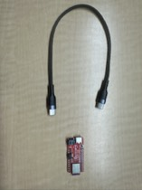
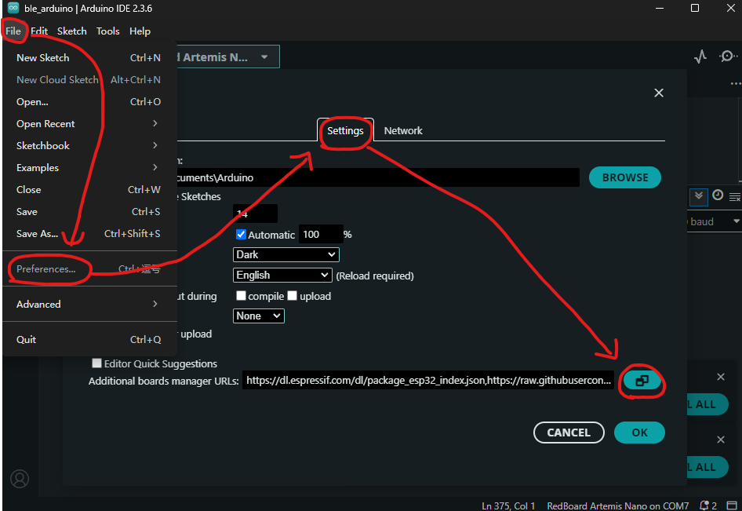
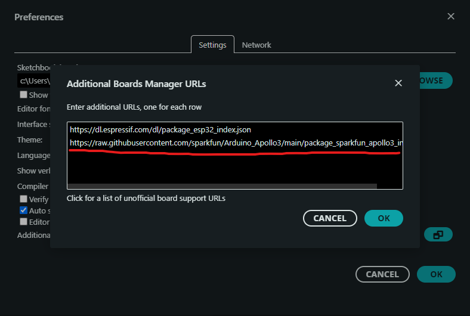
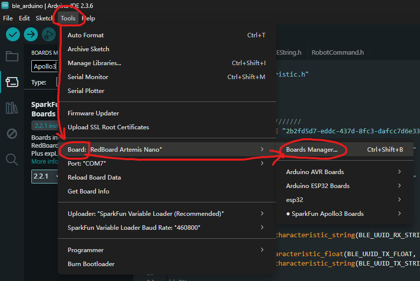
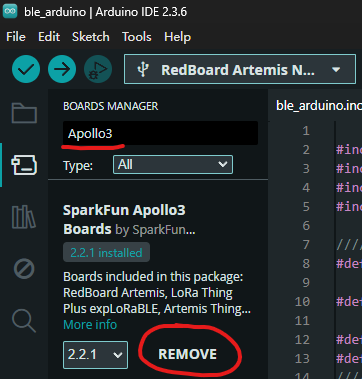
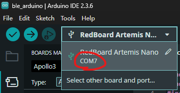
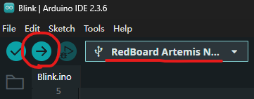
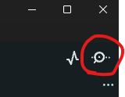
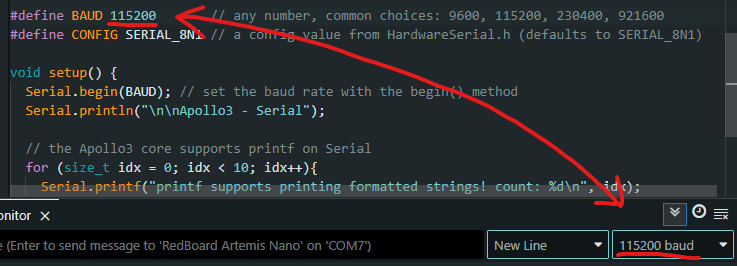

<style>
#jump-nav {
  position: fixed;
  top: 240px;    
  left: 60px;   
  width: 360px;  
  font-family: sans-serif;
  background-color: #f8f8f8;
  padding: 10px;
  border: 1px solid #ccc;
  border-radius: 5px;
}
#jump-nav a {
  display: block;
  margin: 5px 0;
  color: #333;
  text-decoration: none;
}
#jump-nav a:hover {
  text-decoration: underline;
}
</style>

<div id="jump-nav">
  <strong>Jump to:</strong>
  <a href="#lab1">Lab 1: The Artemis Board and Bluetooth</a>
  <a href="#lab2">Lab 2</a>
  <a href="#lab3">Lab 3</a>
</div>

<p align="center">
  
</p>

Hi! I'm **Siang Peng**, a senior in ECE at Cornell.<br>
This page will be used to share my coursework in Fast Robots. I hope this page can help future students better understand the requirements of these labs and provide some guidance.<br>
> ⚠️ **Note:** I am using **Windows 11**. If your system is different, check what applies to your system.

# Lab 1: The Artemis Board and Bluetooth {#lab1}
<div style="display:none">
## Parts
- SparkFun RedBoard Artemis Nano × 1  
- USB-C cable × 1  

<p align="center">
  
</p>

---

## Prelab

1. Get Arduino IDE at [Arduino IDE](https://docs.arduino.cc/software/ide/)  
2. Open Arduino IDE → **File → Preferences → Additional Boards Manager URLs**  
  <p align="center">
    
  </p>

3. Paste the following URL in a separate line (if you have previously added other files) and save changes:  
<code>https://raw.githubusercontent.com/sparkfun/Arduino_Apollo3/main/package_sparkfun_apollo3_index.json</code>
  <p align="center">
    
  </p>

4. Go to **Tools → Board → Board Manager**  
  <p align="center">
    
  </p>

5. Search **“Apollo3”** and install **SparkFun Apollo3 Boards**  
  <p align="center">
    
  </p>

> Till now, we have completed all preparations for Lab 1A.

---

## Lab 1A

### Task 1: Connect Artemis board to the computer
First, I hooked the Artemis board up to my laptop. Then I clicked on port selection on the top left corner of Arduino IDE window, and clicked on the COM port that shows up. For me it is COM7; if you have trouble detecting your chip, try a different port on your device.  

<p align="center">
  
</p>

---

### Task 2: Make the built-in LED on board blink
Click **File → Examples → 01.Basics → Blink**  

A new Arduino IDE window pops up. Make sure the correct board and port are selected, then click **Upload**.  

<p align="center">
  
</p>

Now you should be able to see the built-in LED on board blinking blue.  

<!-- Video.1 placeholder -->
<p align="center">
  <!-- Replace with video when available -->
  <video width="400" controls>
    <source src="videos/video1.mp4" type="video/mp4">
    Your browser does not support the video tag.
  </video>
</p>

> If not, check if you have the correct board and port selected.

---

### Task 3: Type in the Serial Monitor
Go to **File → Examples → Apollo3 → Example4_Serial**. Click on the Serial Monitor icon on the top right corner of the Arduino IDE window.  

<p align="center">
  
</p>

Before clicking **Upload**, check if the baud rate of the Serial Monitor matches what it is defined in the script.  
> Baud rate is the number of signal changes per second; if those two do not match, you will receive **garbled text**.  

<p align="center">
  
</p>

Now type any text in the Serial Monitor, you should see it echo back like this:  

<!-- Video.2 placeholder -->
<p align="center">
  <video width="400" controls>
    <source src="videos/video2.mp4" type="video/mp4">
    Your browser does not support the video tag.
  </video>
</p>

---

### Task 4: Read temperature
Go to **File → Examples → Apollo3 → Example2_analogRead**.

> Note: by default the script uses <code>int temp_raw = analogReadTemp()</code>, which gives **raw ADC counts** from the temperature sensor.  
> **ADC value** is the number the sensor outputs after converting its voltage to a digital number.

Later in Lab 1B, we will use <code>float temp_f = getTempDegF()</code> to read **actual temperature values**.  

Now click **Upload**. You should see the Serial Monitor continuously outputting various sensor and voltage readings, including the ADC value from the temperature sensor.  

> By placing your board near the laptop **air vent**, you should see the value goes up, assuming your computer is blowing out hot air.

<!-- Video.3 placeholder -->
<p align="center">
  <video width="400" controls>
    <source src="videos/video3.mp4" type="video/mp4">
    Your browser does not support the video tag.
  </video>
</p>

---

### Task 5: Test microphone
Go to **File → Examples → PDM → Example1_MicrophoneOutput**, then click **Upload**.  

You should see the Serial Monitor continuously outputting the **loudest frequency**.  

> The white noise in the lab was quite loud, so try testing at home instead.

<!-- Video.4 placeholder -->
<p align="center">
  <video width="400" controls>
    <source src="videos/video4.mp4" type="video/mp4">
    Your browser does not support the video tag.
  </video>
</p>

## Prelab

1. Check current installed Python and pip version with terminal command:

    ```bash
    python3 --version
    python3 -m pip --version
    ```

    If `python3` does not work, try `python`, and switch all later `python3` commands into `python`:

    ```bash
    python --version
    python -m pip --version
    ```

2. Upgrade/downgrade Python to **3.10–3.13**.  
> Remember to select the **"Add Python to Path"** option in the installer.  
> **DO NOT** update to Python 3.14, there is an async issue with Bleak and the lab codebase.

3. Upgrade to the latest version of pip. In terminal, type:

    ```bash
    python3 -m pip install --upgrade pip
    ```

4. Install `venv`:

    ```bash
    python3 -m pip install --user virtualenv
    ```

5. Create a project folder for this course in a convenient location.  
For example, my folder is called `FR`. Right-click inside this folder and open the terminal. Then enter:

    ```bash
    python3 -m venv FastRobots_ble
    ```

    > A folder named `FastRobots_ble` should be created.

6. In the same terminal, enter the following to activate the virtual environment:

    ```bash
    .\FastRobots_ble\Scripts\activate
    ```

7. Your CLI prompt should now have the prefix `(FastRobots_ble)`.
  <p align="center">
    
  </p>

> To exit this virtual environment, enter `deactivate`. Do not do it for now.

8. To install packages inside this virtual environment, enter:

    ```bash
    pip install numpy pyyaml colorama nest_asyncio bleak jupyterlab
    ```

9. Download the Lab Codebase: [ble_robot_1.4.zip](https://fastrobotscornell.github.io/FastRobots-2026/labs/ble_robot_1.4.zip)

10. After extracting, copy the `ble_robot_1.4` folder into the same directory as `FastRobots_ble`.  
> Your project folder should now contain both folders.

11. In the terminal, enter:

    ```bash
    jupyter lab
    ```

> Make sure the virtual environment is activated. A browser tab should open up.

12. Open Arduino IDE, go to **Tools → Manage Libraries**, type `ArduinoBLE` in the search bar, and install the one published by Arduino.
  <p align="center">
    
  </p>
  <p align="center">
    
  </p>

13. Go to `project_file/ble_robot_1.4/ble_arduino`, load and upload the sketch `ble_arduino.ino` to your board.  
> You should see the MAC address of your Artemis board being printed in the Serial Monitor.
  <p align="center">
    
  </p>

14. In Jupyter Lab, open `connection.yaml`, replace `artemis_address` with the MAC address shown in Arduino Serial Monitor.
  <p align="center">
    
  </p>

15. Go to `demo.ipynb` in Jupyter Lab and run the first code cell.  
> You can press Shift+Enter to run a selected code cell.  
> Every time you restart Jupyter Lab, always remember to run this code block.
  <p align="center">
    
  </p>

16. Create a new code cell right below and type in the following two lines:

    ```bash
    from uuid import uuid4
    uuid4()
    ```

> Run the code block and you should see your UUID.  

17. Go to `connection.yaml`, replace `ble_service` with the new UUID.
  <p align="center">
    
  </p>

18. In `ble_arduino.ino`, replace `BLE_UUID_TEST_SERVICE` with the new UUID.
  <p align="center">
    
  </p>

19. Re-upload `ble_arduino.ino` on the Artemis board.

20. Run through all the cells in `demo.ipynb`.

> Note: You **DO NOT** need to regenerate a new UUID every time you upload a new `ble_arduino.ino`, but you will need to run the above cell to reconnect.
  <p align="center">
    
  </p>

> Till now, we have completed all preparations for Lab 1B.

# Lab 1B

---

## Tasks 1: send and receive string
Activate the virtual environment and start Jupyter Lab. In ble_arduino.ino, locate case ECHO: and observe that the text sent from Python is already stored in char_arr. By adding Serial.print / Serial.println, the goal could be easily achieved. Then, rerun Prelab Step 20 in demo.ipynb to reconnect to the Artemis board. Finally, run

  ```bash
  ble.send_command(CMD.ECHO, "HIHELLO")
  ```

in **demo.ipynb; you should see the output in the Arduino IDE Serial Monitor.**

<p align="center">
  
</p>

---

## Tasks 2: SEND_THREE_FLOATS
Look at case SEND_TWO_INTS:; this makes it easy to understand how to write SEND_THREE_FLOATS. The only difference is that the local variables we define should be float instead of int. Finally, reconnect to the Artemis board， and run

  ```bash
  ble.send_command(CMD.SEND_THREE_FLOATS, "2.2|3.3|4.4")
  ```

You can use any three floats you like. you should see the output in the Arduino IDE Serial Monitor.

<p align="center">
  
</p>

---

## Tasks 3: GET_TIME_MILLIS
Note that neither cmd_types.py nor ble_arduino.ino currently include the GET_TIME_MILLIS command type. To simplify future steps (after Lab 1B), we create the needed commands all at once.  

In cmd_types.py, add three lines:

  ```bash
  GET_TIME_MILLIS = 6
  SEND_TIME_DATA = 7
  GET_TEMP_READINGS = 8
  ```

<p align="center">
  
</p>

In ble_arduino.ino, locate the enum CommandTypes and add:

  ```bash
  GET_TIME_MILLIS,
  SEND_TIME_DATA,
  GET_TEMP_READINGS,
  ```

<p align="center">
  
</p>

Be careful: the order is very important. The numbers in cmd_types.py must match the positions in ble_arduino.ino.

now we define GET_TIME_MILLIS inside the switch (cmd_type) {}.  
In case PING, you can see the code pattern to use and call millis(). Following this makes it easy to implement GET_TIME_MILLIS.

Upload and reconnect, in demo.ipynb, create a new cell block and enter

  ```bash
  ble.send_command(CMD.GET_TIME_MILLIS, "")
  s = ble.receive_string(ble.uuid['RX_STRING'])
  print(s)
  ```

Run this code block and you should see

<p align="center">
  
</p>

---

## Tasks 4: notification handler
In demo.ipynb, create a function (I used notification_handler) that uses string.split()[ ] to extract everything after the ":". Then create a code block like this to call GET_TIME_MILLIS and use the handler to get the time since boot

<p align="center">
  
</p>

---

## Tasks 5: data-rate test
In demo.ipynb, create a new code block. Since we already import time at the top, we can use it as a timer. During the timing period, repeatedly call GET_TIME_MILLIS and use the handler to get the time. Store all the retrieved time values in a list.

<p align="center">
  
</p>

---

## Task 6: batched data transfer
We have already defined case SEND_TIME_DATA in Task 3; now we define it directly inside the switch (cmd_type) {}.but leave it empty for now

In the Global Variables section, define unsigned long time_stamps[reasonable_length] and a timer index variable int time_idx = 0;. In loop(), locate the while (central.connected()) {} — this loop runs after the Python side connects. Inside it, add an if statement: if time_idx is less than your chosen time_stamps length, write to time_stamps[time_idx] and increment time_idx. Otherwise, enter a secondary for loop (for (int i = 1; i < reasonable_length; i++)) to shift the entire array left by one. After the loop, the last element is free, so write the latest millis() there.

You might notice that here I’m using a sliding window. For example, if we didn’t do this and simply reset time_idx, the time stamps [1,2,3,4,5] could become [6,7,8,4,5] after three updates, instead of [4,5,6,7,8].  
Now let’s go back to case SEND_TIME_DATA. In this logic, we create a char array to hold the current values from time_stamps and concatenate them with commas. We need to check if the char array has enough space before adding the next time stamp — if there isn’t enough space, we stop adding more. Then we use tx_estring_value.append to build the string and send it.  
Back in JupyterLab, we can now time the call to SEND_TIME_DATA and receive a string in the format:  
fitst time stamp,...,last time stamp or fitst time stamp,...,last time stamp,

<p align="center">
  
</p>

---

## Task 7: adding temperature to the array
In the Global Variables section, create unsigned long temp_readings with the same length as time_stamps.  
In while (central.connected()) {}, add temp_readings[time_idx] = getTempDegF() using the sliding window logic — basically, right after time_stamps[time_idx] = millis(), add temp_readings[time_idx] = getTempDegF().  
Then look at case GET_TEMP_READINGS. It is similar to SEND_TIME_DATA, except that we send:  
first time stamp:first temp reading,...,last time stamp:last temp reading

Note that the string may still have a trailing comma. Use an appropriate method to extract each "time stamp:temp reading" pair, and then use the notification handler to store the timestamps and temperature readings separately into two arrays.

<p align="center">
  
</p>

---

## Task 8: Discuss data transferring methods
By comparing the single time stamp transfer rate of 4.2/sec in Task 5 with the array of time stamps transfer rate of 57.76/sec in Task 6, we can see that the batched data transfer rate is much higher than sending individual time stamps.

This is because each time a time stamp is sent, BLE has to perform a GATT write/notify operation. By sending multiple time stamps at once, the time cost is spread across more data, significantly reducing the “per time stamp” cost.

---

## Discussion
In Lab 1A, we mainly installed the SparkFun Apollo drivers and became familiar with the basic operations of the Arduino IDE, including understanding the serial monitor and baud rate. In Lab 1B, we performed simple BLE communication between Python and the board, and learned that each GATT write/notify has a fixed overhead, so sending data in batches can spread the overhead across more data, thereby increasing the transfer rate.

</div>


# Lab 2: IMU Setup and Testing {#lab2}

## Set up the IMU
In Lab 2, I first connected the IMU to the Artemis Nano. The connection is shown below:


Using the example code from the **ICM20948 library**, the IMU runs correctly, as shown here:


The `AD0_VAL` pin determines the I2C address. When multiple identical devices are connected to the same I2C bus, this value must be modified to differentiate the hardware.

The current example code output does not give the angles we expect. To compute the proper angles, we need to use formulas mentioned in lecture. The original output is also hard to read; rapid numeric updates make trends difficult to observe. Therefore, I modified the data output format so it can be visualized with the **Serial Plotter**, which also helps with tuning the low-pass filter.  

Additionally, to easily check if the IMU is running, I set the **built-in blue LED** to stay on.

---

## Accelerometer

The formulas to compute pitch and roll from the accelerometer readings are:

\[
\text{Pitch} = \arctan2(a_x, a_z) \times \frac{180}{\pi}
\]  
\[
\text{Roll} = \arctan2(a_y, a_z) \times \frac{180}{\pi}
\]

Since gravity is always vertical, the accelerometer cannot measure yaw.  

For testing purposes, I output the calculated pitch/roll in `pitch,roll` format so it can be observed in the Serial Plotter. I tilted the IMU along the +pitch and +roll directions and observed the following:


---

## Quantifying Accelerometer Accuracy

I modeled the accelerometer measurement as:

\[
\text{Measured value} = \text{Scale factor} \times \text{True value} + \text{Bias}
\]

Using the IMU’s raw ADC output range (e.g., ±32768 corresponding to ±1g):

1. Place the IMU stationary with **+Z upward**, measure for a period, and record the average as `az_pos`.
2. Place the IMU with **+Z downward**, measure for a period, and record the average as `az_neg`.

The **bias** is then:

\[
b = \frac{az\_pos + az\_neg}{2}
\]

The **scale factor** is:

\[
S = \frac{32768}{az\_pos - az\_neg}
\]

These values quantify the accelerometer’s systematic error and measurement accuracy. The computed scale factor and bias are shown below:


The errors are small enough that I did not apply scaling or bias correction to the accelerometer readings.

---

## Frequency Analysis and Low-Pass Filter Design

I manually extracted a segment of the IMU jitter from the Serial Monitor and created a Python script to analyze its frequency domain. Using 95% of the signal energy as the cutoff frequency, I obtained the following:

  
  


Using these three cutoff frequencies, I designed a low-pass filter for the accelerometer. Testing with 90% energy as cutoff still showed noticeable noise in the Serial Plotter. Using 95% energy produced good results.  

In the plot below, the **blue line** is the filtered accelerometer data, and the **orange line** is unfiltered:


<div style="text-align:center; font-weight:bold; padding:20px; background-color:#fff3cd; border:1px solid #ffeeba; border-radius:5px;">
LAB1 content is currently being updated based on feedback and will be published again shortly.
</div>
